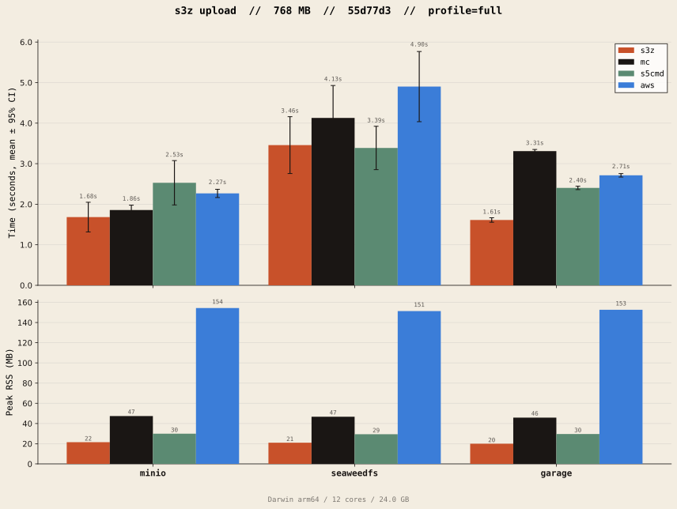
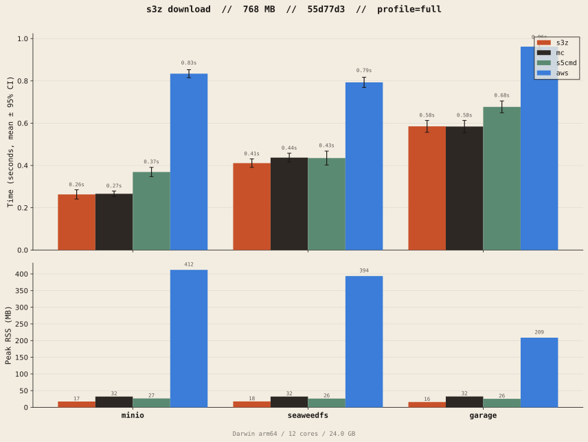
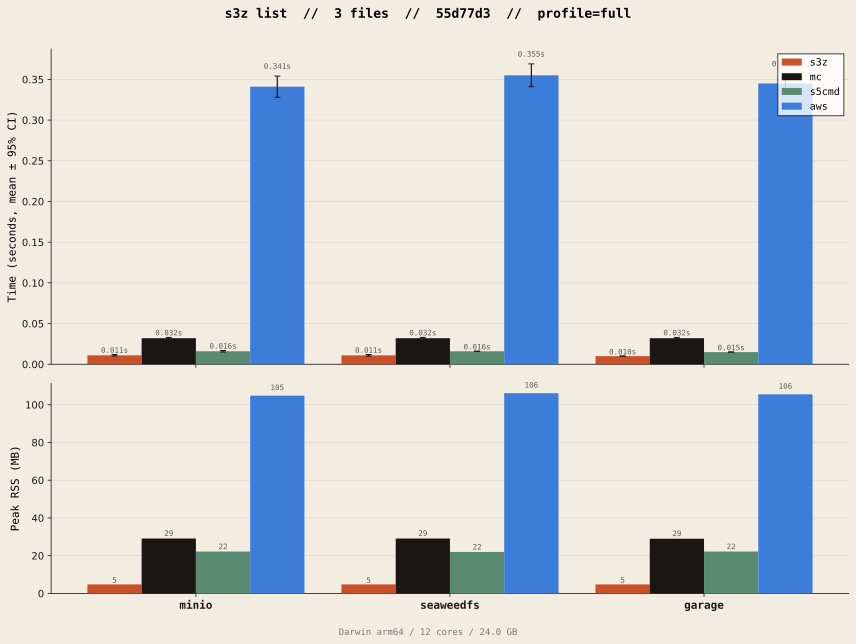

<p align="center">
  <picture>
    <source media="(prefers-color-scheme: dark)" srcset="public/banner-dark.svg">
    <source media="(prefers-color-scheme: light)" srcset="public/banner-cream.svg">
    
  </picture>
</p>

<p align="center">
  <strong>S3 ops, but fearlessly fast.</strong><br>
  <sub>Built in Rust. Streaming. Parallel. No bloat.</sub>
</p>

A very lightweight, high-throughput S3 library/client.

## Install the s3z CLI

On Linux/macOS:

```bash
curl --proto '=https' --tlsv1.2 -LsSf https://github.com/jaeaeich/s3z/releases/latest/download/s3z-cli-installer.sh | sh
```

On Windows:

```powershell
irm https://github.com/jaeaeich/s3z/releases/latest/download/s3z-cli-installer.ps1 | iex
```

### Build from source

Requires the [Rust toolchain](https://rustup.rs).

```bash
cargo install --git https://github.com/jaeaeich/s3z s3z-cli
```

## Benchmarks

Benchmarked against `mc`, `s5cmd`, and `aws-cli` on dockerized S3 backends.

<!-- plots are overwritten by bench:plot — do not rename -->

<p align="center">
  
</p>

<p align="center">
  
</p>

<p align="center">
  
</p>

## Development

### Running benchmarks

```sh
# Inner-loop workflow
mise run bench:dev          # baseline
mise run bench:save         # → target/bench/baseline/  (gitignored)
# ... edit code ...
mise run bench:dev          # measure
mise run bench:compare      # exits non-zero on regression

# Full run — committed reference numbers
mise run bench              # ~10-15 min
mise run bench:save         # → benchmarks/<run-id>/
mise run bench:plot         # regenerates plots/
git add benchmarks/ plots/
```

## License

[MIT](LICENSE)
