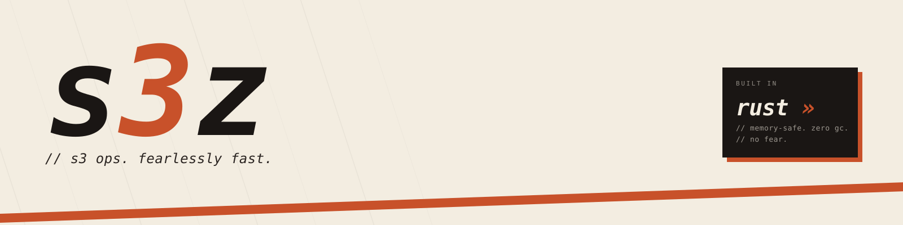

  <picture>
    <source media="(prefers-color-scheme: dark)" srcset="public/banner-dark.svg">
    <source media="(prefers-color-scheme: light)" srcset="public/banner-cream.svg">
    
  </picture>

  <strong>S3 ops, but fearlessly fast.</strong> 
  Built in Rust. Streaming. Parallel. No bloat.

A lightweight, high-throughput S3 client built on raw HTTP and SigV4 signing.

## License

MIT
